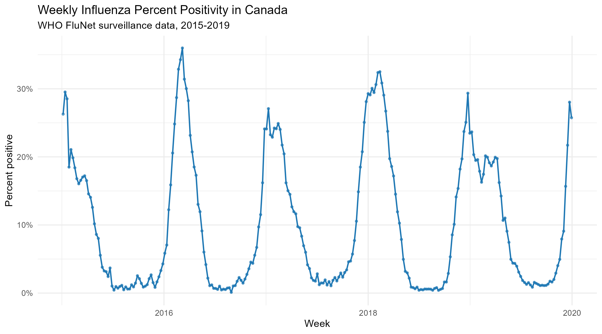
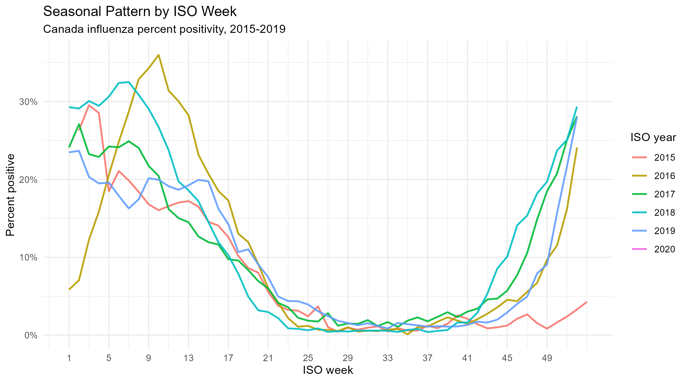
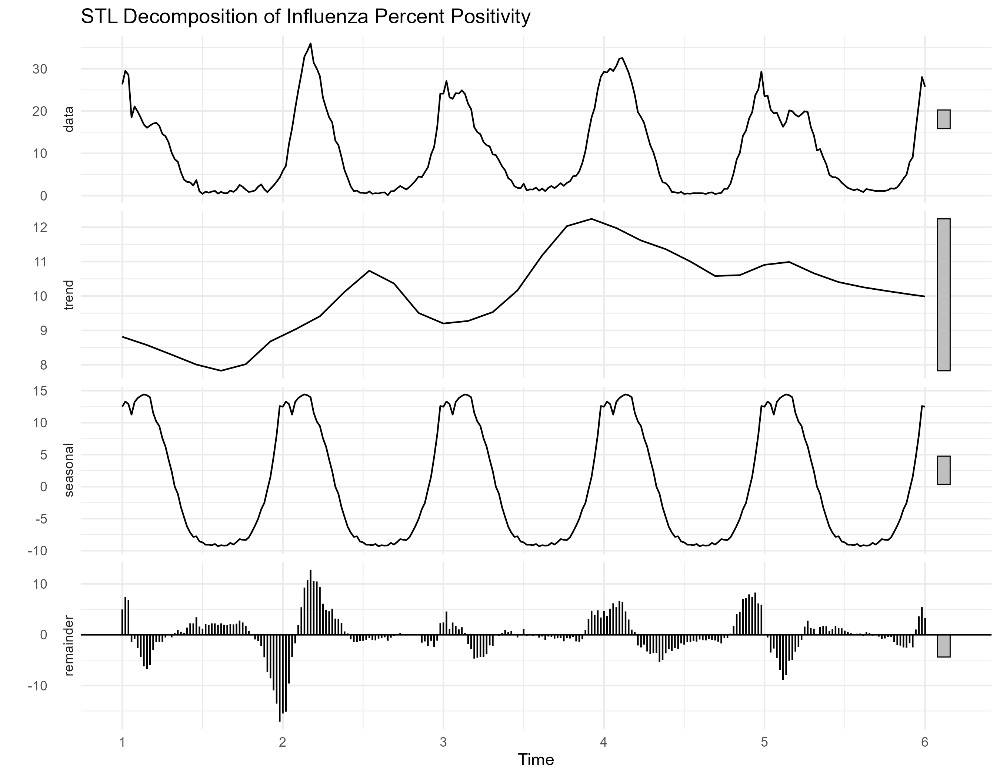
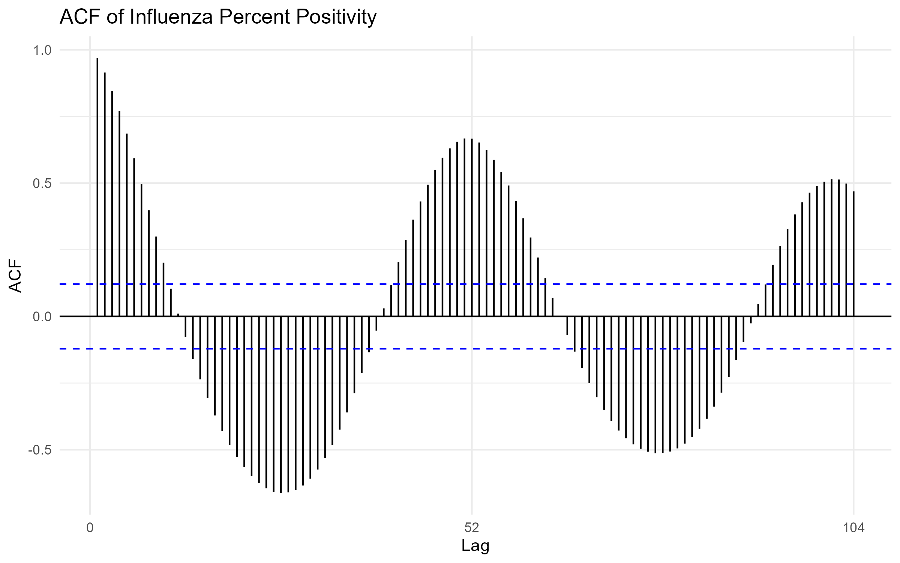
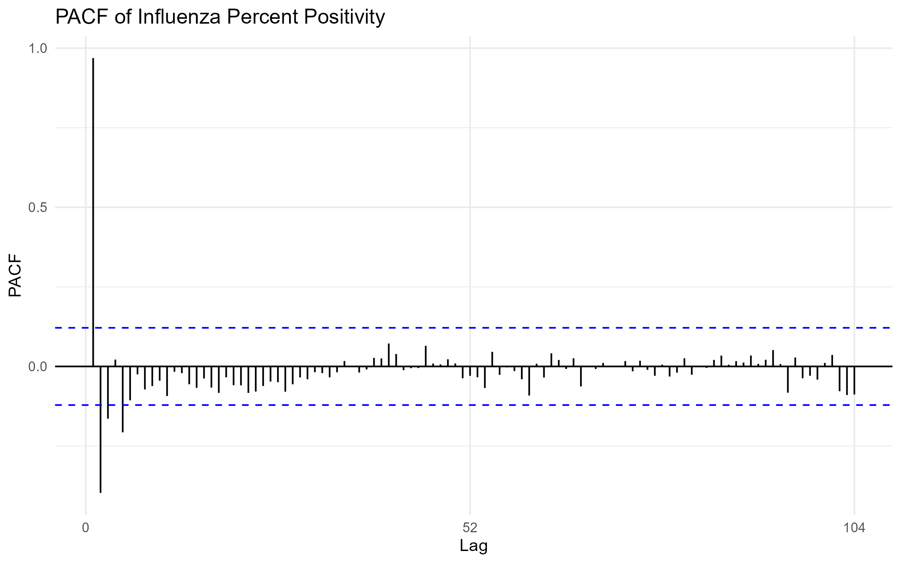
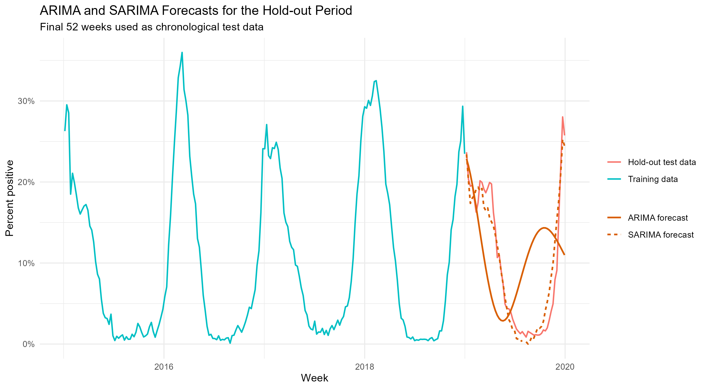
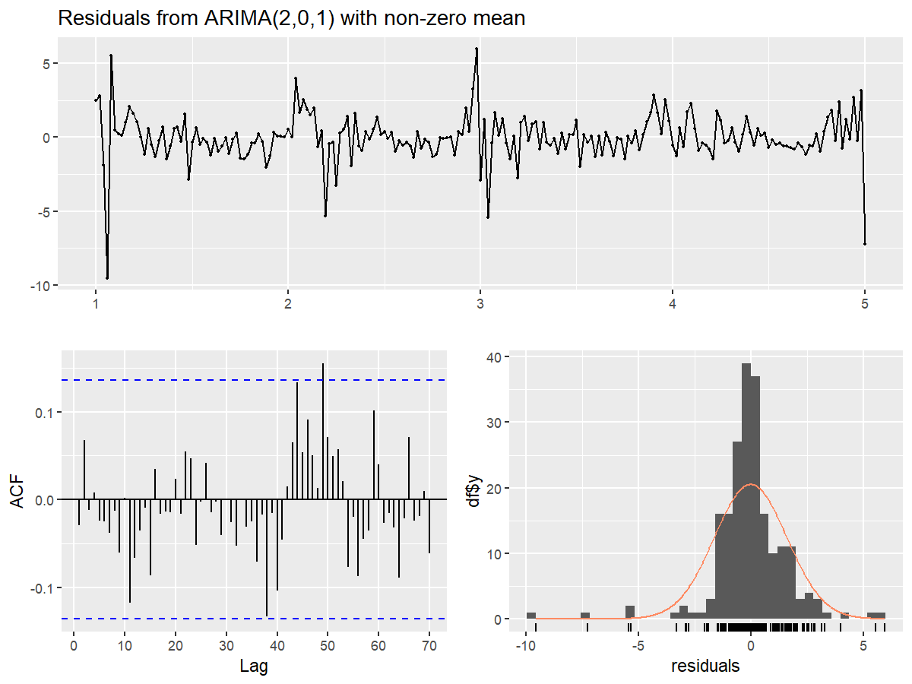
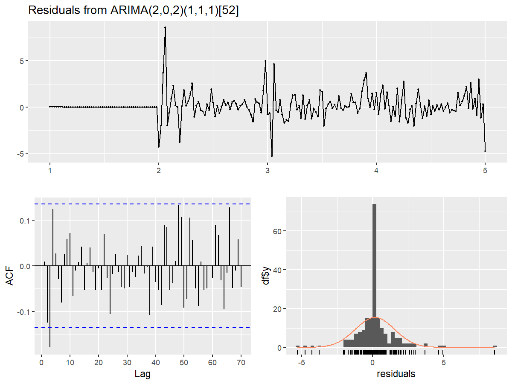

# Seasonal Time Series Forecasting of Canadian Influenza Percent Positivity Using WHO FluNet Data

## 1. Introduction

This project analyzes weekly Canadian influenza surveillance data from WHO FluNet using statistical time-series methods in R. The main objective is to examine whether Canadian influenza percent positivity shows recurring annual seasonality and to compare non-seasonal ARIMA and seasonal ARIMA forecasting models.

The analysis focuses on statistical forecasting of surveillance data. It does not claim causality and does not explain biological mechanisms.

## 2. Data

The data source is WHO FluNet influenza surveillance data. The expected raw file is:

```text
data/raw/VIW_FNT.csv
```

The raw dataset loaded in this analysis contains 185,072 rows and 53 columns. After filtering to Canada and the main pre-COVID analysis period, the cleaned modeling dataset contains 261 weekly observations from 2015-01-05 to 2019-12-30.

The main variables used were:

| Concept | Variable used |
|---|---|
| Country | `country_area_territory` |
| Week start date | `iso_weekstartdate` |
| ISO year | `iso_year` |
| ISO week | `iso_week` |
| Specimens processed | `spec_processed_nb` |
| Total influenza positives | `inf_all` |

The target variable was influenza percent positivity:

```text
percent_positive = inf_all / spec_processed_nb * 100
```

The cleaned dataset was saved to:

```text
data/processed/canada_flu_percent_positive_2015_2019.csv
```

## 3. Software and R Packages Used

The analysis was conducted in R. The main reproducible script is:

```text
scripts/run_analysis.R
```

The project uses these R packages:

| Package | Purpose |
|---|---|
| `tidyverse` | Data manipulation and workflow utilities |
| `lubridate` | Date handling |
| `readr` | CSV reading and writing |
| `janitor` | Cleaning raw column names |
| `forecast` | ARIMA/SARIMA modeling and diagnostics |
| `tseries` | Augmented Dickey-Fuller stationarity test |
| `ggplot2` | Visualization |
| `here` | Project-root relative paths |
| `zoo` | Time-series helper functions |
| `scales` | Plot axis formatting |

## 4. Methods

### 4.1 Preprocessing

The raw WHO FluNet file was loaded from `data/raw/VIW_FNT.csv`. Column names were standardized with `janitor::clean_names()`. The workflow inspected dimensions, column names, missing values, detected key variables, and unique countries.

The data were filtered to Canada and to the pre-COVID analysis period from 2015-01-01 to 2019-12-31. This period was selected to avoid COVID-era disruptions in influenza circulation, testing behavior, and surveillance reporting.

Rows with missing or invalid percent positivity values were removed.

### 4.2 Exploratory Time-Series Analysis

Exploratory plots were created for the weekly percent positivity series, seasonal pattern by ISO week, STL decomposition, ACF, and PACF.

### 4.3 Stationarity Testing

The Augmented Dickey-Fuller test was used to evaluate whether the time series showed evidence against a unit root.

The null hypothesis of the ADF test is:

```text
H0: The series has a unit root and is non-stationary.
```

### 4.4 Forecasting Models

Two univariate forecasting models were compared:

| Model | Description |
|---|---|
| ARIMA | `forecast::auto.arima(seasonal = FALSE)` |
| SARIMA | `forecast::auto.arima(seasonal = TRUE)` |

The weekly time series used `frequency = 52` to represent annual influenza seasonality. The data were split chronologically, with the final 52 weeks used as a hold-out test set.

Forecast accuracy was evaluated using:

| Metric | Meaning |
|---|---|
| MAE | Mean absolute error |
| RMSE | Root mean squared error |

### 4.5 Residual Diagnostics

Residual diagnostics were evaluated with `forecast::checkresiduals()` and Ljung-Box tests.

The null hypothesis of the Ljung-Box test is:

```text
H0: Residuals are independently distributed with no remaining autocorrelation.
```

## 5. Results

### 5.1 Weekly Influenza Percent Positivity

The weekly time-series plot shows recurring winter peaks in Canadian influenza percent positivity during 2015-2019. This visual pattern is consistent with annual influenza seasonality.



### 5.2 Seasonal Pattern by ISO Week

The seasonal plot overlays each year by ISO week. Peaks tend to occur during the winter season, although the timing and magnitude vary by year.



### 5.3 STL Decomposition

The STL decomposition separates the series into trend, seasonal, and remainder components. The seasonal component indicates recurring within-year structure in the weekly percent positivity series.



### 5.4 ACF and PACF

The ACF and PACF plots were used to inspect autocorrelation structure before model fitting.





### 5.5 ADF Stationarity Test

The ADF test result was:

| Statistic | Value |
|---|---:|
| Dickey-Fuller statistic | -4.7462 |
| Lag order | 6 |
| p-value | 0.01 |

The p-value was reported as smaller than the printed p-value. This provides evidence against the unit-root null hypothesis for the 2015-2019 percent positivity series.

### 5.6 ARIMA and SARIMA Model Selection

The selected models were:

| Model | Selected order |
|---|---|
| ARIMA | ARIMA(2,0,1) with non-zero mean |
| SARIMA | ARIMA(2,0,2)(1,1,1)[52] |

The SARIMA model includes seasonal differencing and seasonal AR/MA terms at the weekly annual frequency.

### 5.7 Forecast Accuracy Comparison

The final 52 weeks were used as the chronological hold-out test set.

| Model | MAE | RMSE |
|---|---:|---:|
| SARIMA | 1.67 | 2.20 |
| ARIMA | 7.48 | 8.77 |

SARIMA had substantially lower MAE and RMSE than ARIMA in this split. This supports the usefulness of recurring seasonal structure for forecasting Canadian influenza percent positivity during the 2015-2019 pre-COVID period.



### 5.8 Residual Diagnostics

The residual diagnostic plots and Ljung-Box tests were used to assess whether autocorrelation remained after model fitting.

| Model | Ljung-Box lag | Model df | Test df | Statistic | p-value |
|---|---:|---:|---:|---:|---:|
| ARIMA | 24 | 4 | 20 | 11.11 | 0.943 |
| SARIMA | 24 | 6 | 18 | 25.03 | 0.124 |

Both Ljung-Box p-values were greater than 0.05, so there was no strong evidence of remaining residual autocorrelation based on these tests.





## 6. Discussion

The exploratory plots show clear recurring winter increases in influenza percent positivity. The SARIMA model performed better than the non-seasonal ARIMA model on the final 52-week hold-out period, with lower MAE and RMSE.

This result supports the presence of recurring seasonal structure that is useful for statistical forecasting. However, the model should be interpreted as a forecasting model for surveillance data, not as a causal or mechanistic explanation of influenza transmission.

## 7. Limitations

This analysis has several limitations:

- The analysis uses national-level Canada data only.
- Surveillance data can be affected by testing behavior, reporting changes, case definitions, and laboratory practices.
- The 2015-2019 period was intentionally selected to avoid COVID-era disruptions, so results do not describe pandemic-era influenza dynamics.
- The hold-out comparison uses one chronological split. Additional sensitivity checks could evaluate other train/test windows.
- Weekly seasonality was modeled with `frequency = 52`, although ISO years can contain 53 weeks.
- SARIMA performance may vary if the analysis period, test window, or model search settings are changed.

## 8. Conclusion

This project provides a reproducible R-based seasonal time-series analysis of Canadian influenza percent positivity using WHO FluNet data.

The results show recurring annual seasonality in Canadian influenza percent positivity during 2015-2019. In the hold-out forecast comparison, SARIMA outperformed non-seasonal ARIMA, supporting the value of seasonal structure for forecasting this surveillance series.

Overall, the project demonstrates a clean statistical forecasting workflow for public health surveillance data while clearly acknowledging the limitations of surveillance-based time-series modeling.

## 9. Reproducibility

To reproduce the full analysis, open the RStudio project file and run:

```r
source("scripts/run_analysis.R")
```

The script regenerates cleaned data, figures, tables, and the text summary.

Main outputs:

```text
data/processed/canada_flu_percent_positive_2015_2019.csv
tables/model_comparison.csv
tables/residual_diagnostics.csv
reports/analysis_summary.txt
reports/final_report.md
```
